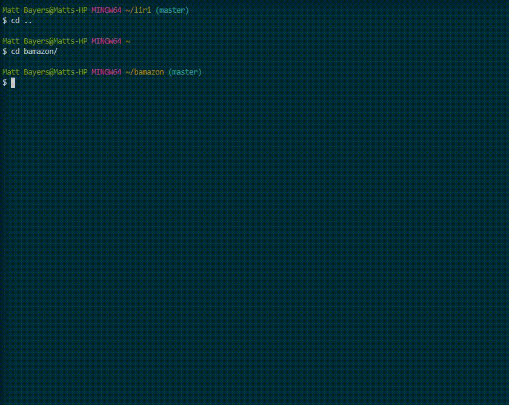

BAMAZON

A simple app that uses javascript to manipulate an bamazon_DB.

When ran in terminal using node, it will show all products from database including:

Unique ID, Product Name, Department, Price, & Quantity

Once this information is populated an inquirer prompt will ask which product user would like to purchase
using a product ID, then how many?

If there are enough products inventory is updated and the total price is printed to the screen.

If not, an "insufficient amount" is printed out.

